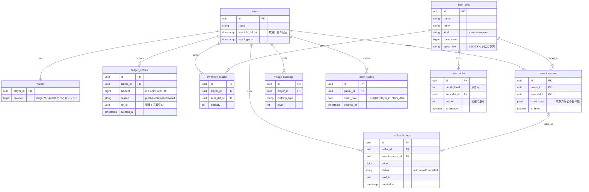

# データモデル設計書（洞窟発掘 × 放置ゲーム）

> このドキュメントは「どうデータを持つか」を定義する。
> 「何を作るか（機能とMVPの線引き）」は `docs/spec.md` を親として参照すること。
> 学習の主軸・全体像は `CLAUDE.md` / `docs/roadmap.md` を正とする。

このデータモデルは「ゲームの皮」ではなく、**主軸（データ整合性を守る堅牢なバックエンド設計）**を
学ぶための“経済の背骨”に絞った設計。戦闘ログやアニメ等の演出系は後回し。

---

## 先に決めておくこと（設計の前提）

- **すべてサーバーが正**: ドロップ・戦闘結果・放置進行はサーバーが計算。クライアントは「意図」だけ送り、描画に徹する。これが整合性と不正対策の土台。
- **アイテムは2種類に分ける**
  - 素材など量で持つもの → `inventory_stacks`（数量で管理）
  - レア武器など1点ものでステータスが振れるもの → `item_instances`（1行＝1個・固有ID）。「このレアを売る」はこれがないと成立しない。
- **通貨は元帳が正**: 残高は `ledger_entries` から導出（`wallets` はキャッシュ）。銀行案件と同じ構造。

---

## ER図



---

## 各テーブルの役割と“学べること”

| テーブル | 役割 | ここで学ぶ |
|---|---|---|
| players / wallets | アカウントと残高キャッシュ | 基本のCRUD・関連 |
| ledger_entries | 通貨の動きを全部記録（複式） | 元帳設計・整合性 |
| inventory_stacks | 量で持つ素材 | 加減算の原子性 |
| item_instances | 1点もののレア | 所有権の移動 |
| market_listings | マーケット出品 | **同時購入のロック（山場）** |
| village_buildings | 村の発展＝通貨/素材のシンク | 複数リソースを1トランザクションで消費 |
| daily_claims | ログインボーナス | **冪等性（UNIQUE制約）** |
| drop_tables | サーバー側のドロップ抽選 | 参照データ設計 |

---

## 週次プランとの対応（クリティカルな操作）

### 1. アイテム購入（マーケット）＝ Week 3 の本丸
```
BEGIN
  SELECT * FROM market_listings WHERE id = ? FOR UPDATE   -- 行ロック（Drizzle: .for('update')）
  -- status = 'active' を確認（でなければ ROLLBACK）
  -- 買い手 wallet から出金（ledger に負の entry）
  -- 売り手 wallet へ入金（ledger に正の entry）
  -- 手数料をシンクへ（ledger）
  -- item_instances.owner_id を買い手に更新、is_listed = false
  -- market_listings.status = 'sold', sold_to = 買い手
COMMIT
```
- **Week 3 の山場**: 同じ listing を並列で買うスクリプトを撃つ → 二重販売を再現 → `FOR UPDATE` で修正 → Vitest + 実Postgres で自動テスト化。

### 2. 放置報酬の付与 ＝ 冪等に
`now() − last_idle_tick_at` から獲得量を計算 → 付与 → `last_idle_tick_at` を更新（同一トランザクション）。リトライしても二重付与にならない。クライアントの経過時間は信用せず、必ずサーバー時刻で計算。

### 3. デイリー報酬 ＝ 物理的に二重取得を防ぐ
`UNIQUE(player_id, claim_date)` 制約で、連打しても2回目は失敗。冪等性の一番きれいな教材。

### 4. 村のアップグレード ＝ 複数リソースの同時消費
素材と通貨をまとめて消費して建物Lvを上げる。「全部成功 or 全部失敗」をトランザクションで担保。

---

## いまは後回しでOK（non-goal）

戦闘の詳細ログ、アニメ・演出、リアルタイム通知、フレンド機能、ギルドなど。
まずは上の“背骨”を **本番（Docker + Fly.io + Neon Postgres）まで一本通す** のが最優先。
※ AWS/RDS は「今回の本番」ではなく、本プロジェクト後に学ぶ移行先候補。

---

## 接続・実装上の注意（会話で確定した事項）

- DB接続は **素のTCP標準ドライバ（`postgres` パッケージ）** を使う。`@neondatabase/serverless`（HTTP）は
  インタラクティブtrを保持できず `FOR UPDATE` が成立しないため**使わない**。常駐サーバ（Fly.io）なのでTCPで問題ない。
- マイグレーション（Drizzle Kit）は **直結（unpooled）文字列**、アプリ実行は**プール接続**を使い分ける。
- ORM は Drizzle。行ロックは `.for('update')` をクエリビルダ（`db.select()...`）で明示。
  リレーショナルクエリAPI（`db.query.*`）には `.for()` が無い点に注意。
